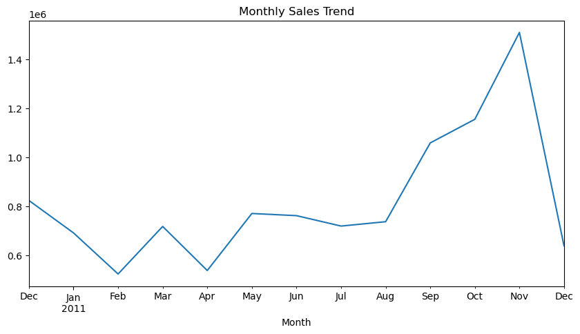
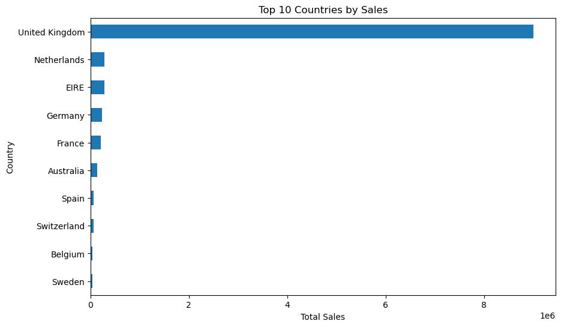

# E-commerce Sales Analysis

## Project Overview
This project analyzes e-commerce transaction data to identify:
- sales trends
- top-performing products
- geographic sales distribution
- business insights

## Tools Used
- Python
- Pandas
- Matplotlib
- Jupyter Notebook

## Key Insights
- Strong sales concentration in the UK market
- Seasonal sales growth in Q4
- Revenue concentration among a small subset of products

## Visualizations

### Sales Trend

### Sales by Country

